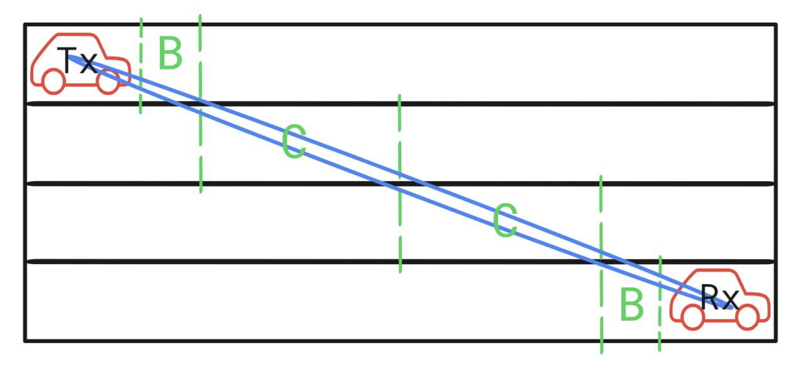
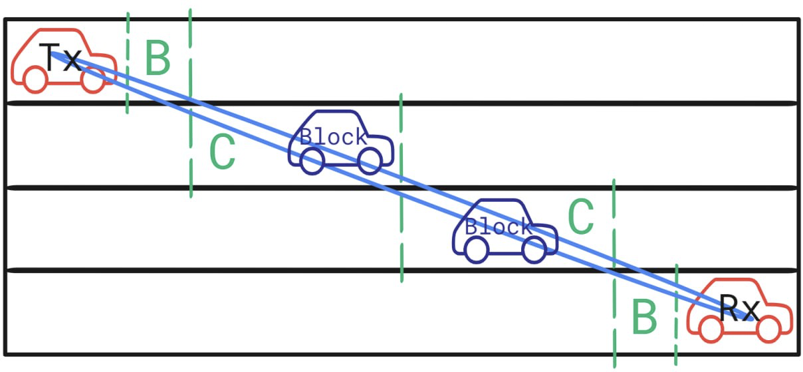
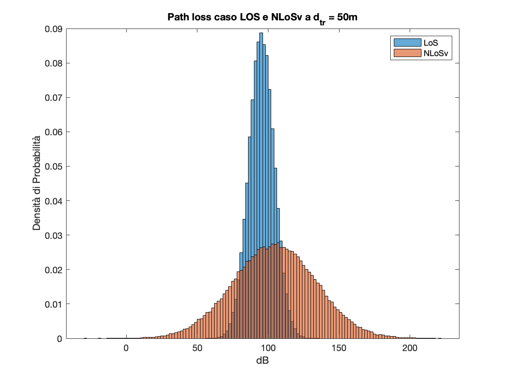
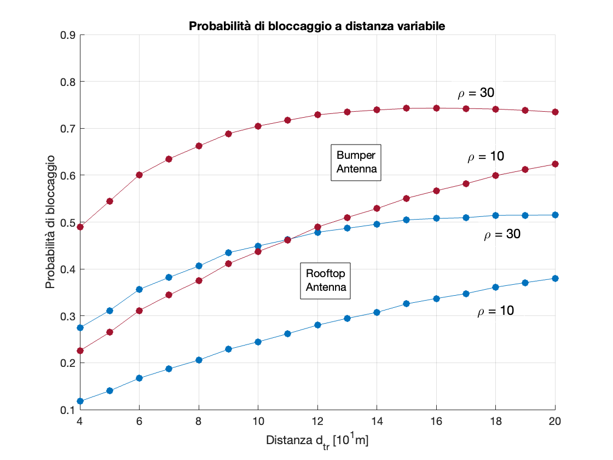
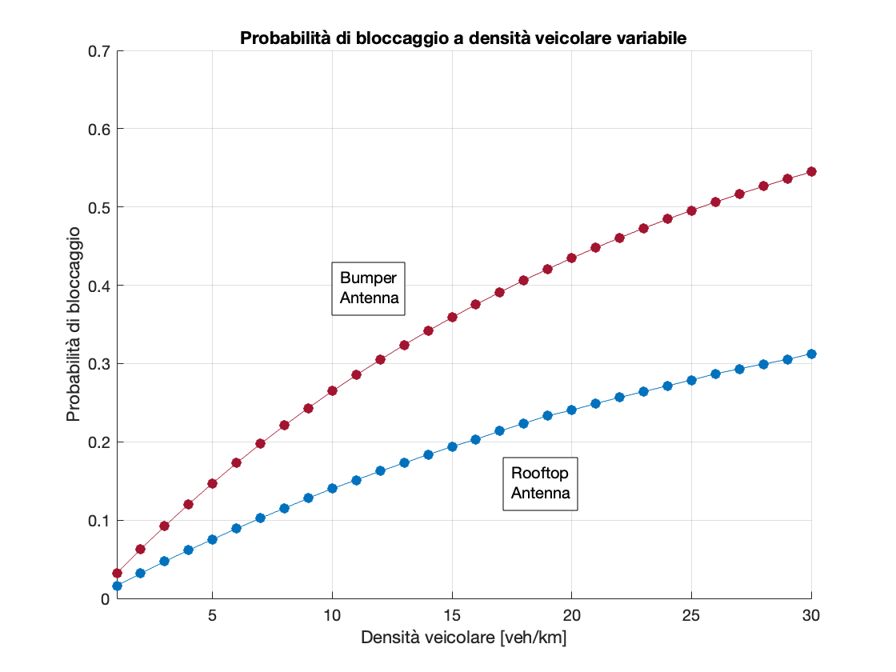
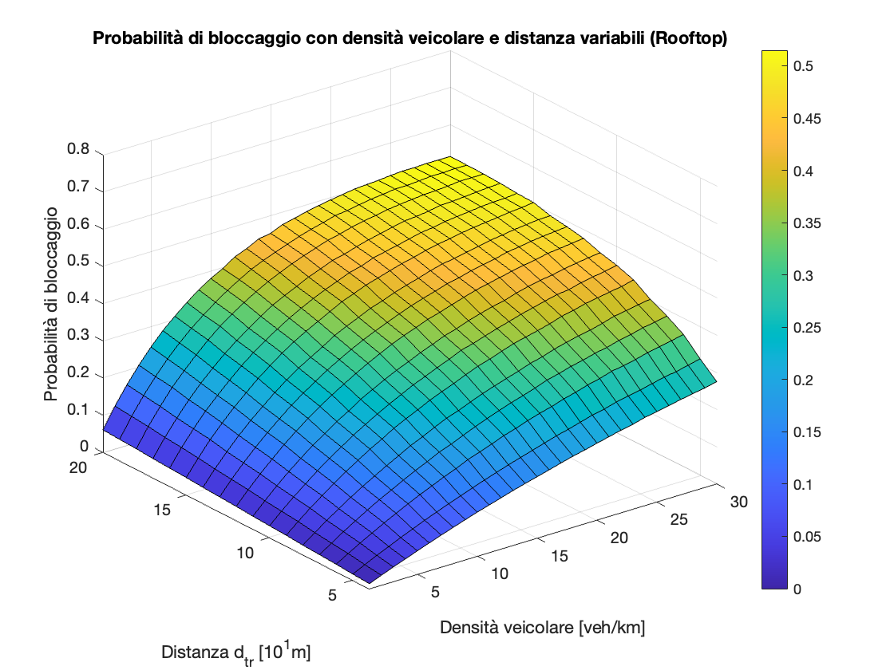
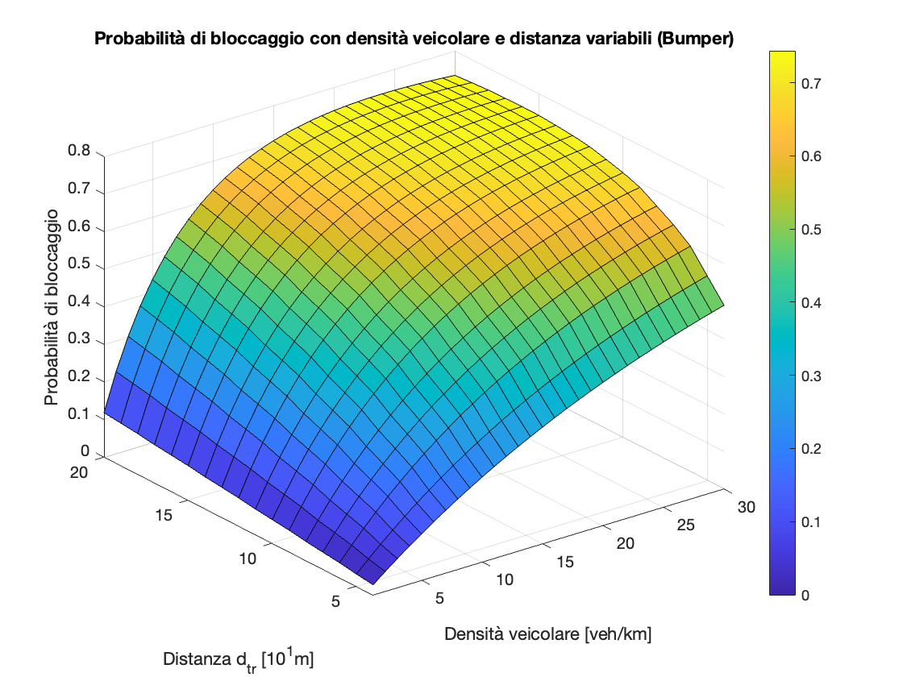

<!-- ---
geometry: "margin=2.5cm"
--- -->

# Progetto SDC - A.A. 2022-2023

Progetto di Sistemi di Comunicazione dell'Anno Accademico 2022-2023, relativo alle trasmissioni veicolari. I partecipanti del gruppo sono:

* Matteo Benzo - matteo.benzo@mail.polimi.it
* Alessia Gadda - alessia.gadda@mail.polimi.it
* Luca Moriondo - luca.moriondo@mail.polimi.it

I paper di riferimento per il progetto sono:

- [Performance of DSRC for V2V Communications in urban and highway environments](https://ieeexplore.ieee.org/abstract/document/6335027?casa_token=GUbaLT-9GMEAAAAA:eGuqNF_4uVOJGyble-5WCizXHkKZoeAraOJAwhtuDcCpooBP9ZVR2ZVIxsxmAE9-8kGT2qMl)
- [Vehicular Blockage Modelling and Performance Analysis for mmWave V2V Communications](https://ieeexplore.ieee.org/abstract/document/9838711?casa_token=tCe-ZCrgnSoAAAAA:iDeXXihvhmJ2rYX6IvGF9tHlCz9V_wQgAVnqdavT6jiiOrF05iUKiDT-SnLcFWNhJvwgtpow)

Sono stati usati a supporto del progetto anche i seguenti documenti:

- [Study on evaluation methodology of new vehicle-to-everything](https://portal.3gpp.org/desktopmodules/Specifications/SpecificationDetails.aspx?specificationId=3209)

## Indice
- [Relazione](#relazione)
    1. [Introduzione](#introduzione)
    2. [Parametri e variabili della simulazione](#parametri)
        - [Sistema di comunicazione](#parsdc)
        - [Veicoli](#parveicoli)
        - [Scenario](#parscenario)
        - [Variabili](#parvariabili)
    3. [System Model](#systemmodel)
    4. [Vehicular Blockage Modelling](#blockage)
        - [Analisi Same Lane](#samelane)
        - [Analisi Different Lanes](#differentlane)
        - [Sintesi](#sintesi)
        - [Distribuzione SNR](#snr)
    5. [Numerical Simulations](#numerical)
- [Risultati](#risultati)
    1. [System Model](#rismod)
    2. [Vehicular Blockage Modelling](#risblo)
    3. [Numerical Simulations](#rissim)
- [Spiegazione del codice MATLAB](#codice)
    - [File `setup.m`](#matsetup)
    - [File `main.m`](#matmain)
    - [File `simulations.m`](#matsim)
    - [File `plots.m`](#matplots)

<a name="relazione"></a>

# Relazione 

<a name="introduzione"></a>

## Introduzione
Il progetto ha come scopo la caratterizzazione e la simulazione di una trasmissione veicolare, con l'ausilio di un programma sviluppato in linguaggio MATLAB. In particolare, l'impatto che ha la presenza di un veicolo bloccante sul Signal-To-Noise Ratio relativo alla trasmissione tra due veicoli in uno scenario autostradale.<br>
Si andrà ad analizzare la situazione base, ovvero l’assenza di veicoli bloccanti tra il trasmettitore e il ricevitore sulla medesima corsia stradale, per poi studiare quelle più complesse prodotte dalla combinazione di diversi elementi:

- Uno o più veicoli bloccanti
- La posizione dell’antenna sul veicolo
- La presenza di traffico più o meno intenso
- La presenza di più corsie

<a name="parametri"></a>

## Parametri e variabili della simulazione

<a name="parsdc"></a>

### Sistema di comunicazione 
| Parametro                       | Simbolo |  Valore |
|---------------------------------|:-------:|:-------:|
| Potenza del trasmettitore       | $P_{t}$ |  0 dBm  |
| Guadagno antenna trasmettitore  | $G_{t}$ |  10 dB  |
| Guadagno antenna ricevitore     | $G_{r}$ |  10 dB  |
| Potenza di rumore               | $P_{n}$ | -85 dBm |
| Frequenza della portante        |  $f_c$  |  28 GHz |
| Lunghezza d'onda della portante |  $\lambda_c$  |  0.01 m |

<a name="parveicoli"></a>

### Veicoli 
| Parametro                           |   Simbolo  | Valore |
|-------------------------------------|:----------:|:------:|
| Lunghezza del veicoli               |    $l_v$   |   5 m  |
| Larghezza veicoli                   |    $w_v$   |  1.8 m |
| Altezza media veicoli               |   $\mu_v$  |  1.5 m |
| Deviazione standard altezza veicoli | $\sigma_v$ | 0.08 m |
| Altezza media paraurti              |   $\mu_p$  |  0.3 m |

<a name="parscenario"></a>

### Scenario 
| Parametro                       | Simbolo |     Valore     |
|---------------------------------|:-------:|:--------------:|
| Lunghezza scenario              |   $D$   |      200 m     |
| Numero di corsie                |   $M$   |        4       |
| Larghezza delle corsie          |  $W$    |      3.5 m     |
| Distanza di sicurezza           |  $d_s$  |      2.5 m     |
| Densità di traffico considerate | $\rho$  | 10 / 20 veh/km |

<a name="parvariabili"></a>

### Variabili 
| Parametro                         |  Simbolo |
|-----------------------------------|:--------:|
| Distanza Trasmettitore-Ricevitore | $d_{tr}$ |
| Distanza Trasmettitore-Bloccante  | $d_{tb}$ |
| Distanza Bloccante-Ricevitore     | $d_{br}$ |
| Numero di veicoli bloccanti       | $k$      |

<!-- #### Intervalli considerati per le variabili (*singola corsia*):
| Parametro        |       Rooftop      |       Bumper      |
|------------------|:------------------:|:-----------------:|
| $d_{tr}$         |   $7.5 \div 195$   |   $2.5 \div 190$  |
| $d_{tb}, d_{br}$ |  $7.5 \div 187.5$  |    $5 \div 185$   | -->

<a name="systemmodel"></a>

## System Model 
Vengono differenziati due scenari relativi a due modelli di canale:

- *Line-of-Sight* (LoS), ossia il canale in visibilità
- *Non-Line-of-Sight vehicle* (NLoSv), ossia il canale non in visibilità attenuato dalla presenza di veicoli bloccanti

Vengono considerate nell'attenuazione in spazio libero due componenti con distribuzione normale:

- Shadowing component: $\chi\sim \mathcal{N}(0,\sigma_{sh}^2)$
- Attenuazione da bloccaggio: $\mathcal{A}(k)\sim \mathcal{N}(\mu(k),\sigma^2(k))$

Il valore $k\in\mathbb{N}$ rappresenta il numero di veicoli bloccanti nella trasmissione. 
L'attenuazione per il primo veicolo è ottenuta tramite: 
$$9 + \max(0,15\cdot\log_{10}(d_{tb})-41)$$
Pertanto, osservando i risultati del secondo argomento della funzione, nello scenario considerato (200 metri) rimarrà sempre 9dB.<br>
La media dell'attenuazione in spazio libero è calcolata con la formula:
$$\mu_{LoS} = 32.4+20\log_{10}(d_{tr})+20\log_{10}(f_c)$$
da cui deriva quindi la più completa formula che tiene conto dalle attenuazioni introdotte dall'ambiente e dai bloccanti:
$$PL(k) = 32.4+20\log_{10}(d_{tr})+20\log_{10}(f_c) + \mathcal{A}(k) + \chi\ \sim\ \mathcal{N}(\mu_{LoS} + \mu(k), \sigma_{sh}^2) + \sigma^2(k)$$

<a name="blockage"></a>

## Vehicular Blockage Modelling 
La propagazione di un segnale viene ostacolata quando un corpo (nell’ambito di questo progetto, un veicolo) ostruisce il primo ellissoide di Fresnel. Le altezze dei veicoli sono assunte come variabili con distribuzione Gaussiana, con media $\mu_v$ e varianza $\sigma_v$.<br>
Il raggio dipendente dalla lunghezza del primo ellissoide di Fresnel viene calcolato come:
$$\tilde{r} = \sqrt{\lambda_c\frac{d_{tb}\cdot d_{tr}}{d_{tb}+d_{trx}}}\quad\quad \lambda_c=\frac{c}{f_c}$$
Viene inoltre calcolata l'altezza del primo ellissoide di Fresnel, il quale è rappresentabile da una distribuzione Gaussiana:
$$\tilde{h}=h_r\frac{d_{tb}}{d_{tr}}+h_t\frac{d_{br}}{d_{tr}}-0.6\tilde{r}\sim \mathcal{N}(\tilde{\mu},\tilde{\sigma}^2)$$
$$\to \tilde{\mu}=\mu_v-0.6\tilde{r}\quad\quad \tilde{\sigma}^2=\sigma^2_v$$
Per calcolare la probabilità di avere un bloccaggio è necessario definire altezza, media e varianza efficace per il bloccaggio:
$$h_{eff} = h_v-\tilde{h}\quad\quad \mu_{eff}=\mu_v-\tilde{\mu}\quad\quad \sigma^2_{eff}=\sigma_v^2+\tilde{\sigma}^2$$
Stabilito che un bloccaggio avviene nel momento in cui $h_{eff}>0$, possiamo calcolare la probabilità di avere un bloccaggio data la presenza di un veicolo potenzialmente bloccante:
$$\mathbb{P}(\textrm{NLoSv}|d_{tr},\mathcal{B})=Q\left(\frac{h_{eff}-\mu_{eff}}{\sigma_{eff}}\right)$$
La probabilità è dipendente dai parametri della simulazione, quali distanza $d_{tr}$ e densità di automobili $\rho$.<br>
 La probabilità che un veicolo sia su una determinata corsia è $\frac{1}{M}$, dove $M$ è il numero di corsie considerato.

<a name="samelane"></a>

### Analisi Same Lane 
Nel caso in cui trasmettitore, ricevitore e veicolo bloccante siano sulla stessa corsia, dividiamo lo spazio che intercorre tra trasmettitore e ricevitore in $N_s$ slot. Ogni slot è lungo quanto la somma della lunghezza media di un veicolo e la distanza di sicurezza.<br>
$$N_s = \frac{d_{eff}}{d_a} \quad\quad d_{eff} = d_{tr}-l_v \quad\quad d_a = l_v+d_s$$
Viene assegnato per questi slot il nome "tipo A", per distinguerli da quelli presenti nel caso "Different Lane".

<p align="center">
  
</p>

La probabilità che un singolo slot sia occupato da un bloccante viene calcolata assumendo che i veicoli siano distribuiti secondo un processo di Poisson lineare (o Linear Point Poisson Process):
$$\mathcal{P_\textrm{\textit{a}}} = \mathbb{P}(\textrm{NLoSv}|d_a,\mathcal{B})\cdot \mathbb{P}(\mathcal{B}) = Q\left(\frac{h_{eff}-\mu_{eff}}{\sigma_{eff}}\right)\Gamma e^{-\Gamma}\quad\quad \Gamma = \rho \cdot d_a$$
Viene infine calcolata la probabilità di avere un bloccaggio da parte di $k$ veicoli mediante una distribuzione di Bernoulli:
$$\mathbb{P_\textrm{\textit{SL}}}(\textrm{NLoSv}^{(k)}|d_{tr})={N_s\choose k}\mathcal{P_\textrm{\textit{a}}^\textrm{\textit{k}}}(1-\mathcal{P_\textrm{\textit{a}}})^{N_s-k}$$

<p align="center">
  
</p>

<a name="differentlane"></a>

### Analisi Different Lanes 
Analizziamo ora il caso in cui trasmettitore e ricevitore siano su corsie differenti. Analogamente al caso “Same Lane” dividiamo lo spazio che intercorre tra trasmettitore e ricevitore in slot. Essi vengono suddivisi in due tipologie:

- Slot Tipo B: spazio che potrebbe essere occupato da un bloccante sulla stessa corsia di TX o RX;
- Slot Tipo C: spazio che potrebbe essere occupato da un bloccante sulle corsie esistenti tra TX e RX.

<p align="center">
  
</p>

Definita $\Delta y$ la distanza tra i punti medi delle corsie di TX e RX, possiamo definire le lunghezze $d_b$ e $d_c$:
$$d_b = \frac{w_v\sqrt{d_{tr}^2-\Delta y^2}}{2\Delta y}\quad\quad d_b = \frac{w_v\sqrt{d_{tr}^2-\Delta y^2}}{\Delta y}+l_v$$
Si calcola la probabilità di avere TX e RX con uno scostamento laterale pari a $\Delta y = nW, \ n\in\{1,2,\ldots,M\}$:
$$\mathbb{P}(\Delta y = n W) = 2\frac{M-n}{M^2}\to \frac{2}{M^2}+\sum_{n=1}^{M-1}n = \frac{M-1}{M}$$

<p align="center">
  
  <br>
  
  
</p>

Si calcola inoltre la probabilità di avere $k$ bloccanti su un massimo di $M$ slot, poiché in questo caso si considera che non ci sia più di un veicolo bloccante per corsia:
$$\mathbb{P}(K=k)=\sum_{\mathcal{A}\in\mathcal{Q_\textrm{\textit{k}}}}\prod_{i\in\mathcal{A}}\mathcal{P_\textrm{\textit{i}}}\prod_{j\in\mathcal{A^\textrm{\textit{c}}}}(1-\mathcal{P_\textrm{\textit{j}}})$$
Ottenuti questi risultati numerici, possiamo unire le due formule per ottenere la probabilità di avere un bloccaggio da parte di $k$ veicoli:
$$\mathbb{P_\textrm{\textit{DL}}}(\textrm{NLoSv}^{(k)}|d_{tr}) = \frac{2(M-1)}{M^2}{n+1\choose k}\mathcal{P_\textrm{\textit{b}}^\textrm{\textit{k}}}(1-\mathcal{P_\textrm{\textit{b}}})^{n+1+k}+\sum_{n=2}^{M-1}\frac{2(M-n)}{M^2}\sum_{\mathcal{A}\in\mathcal{Q_\textrm{\textit{k}}}}\prod_{i\in\mathcal{A}}\mathcal{P_i}\prod_{j\in\mathcal{A^\textrm{\textit{c}}}}(1-\mathcal{P_\textrm{\textit{j}}})$$

<a name="sintesi"></a>

### Sintesi 
Sintetizzando il caso "Single Lane" con quello "Different Lanes", possiamo ottenere la probabilità di avere un bloccaggio da parte di $k$ veicoli in un contesto generale:
$$\mathbb{P}(\textrm{NLoSv}^{(k)}|d_{tr}) = \mathbb{P_\textrm{\textit{DL}}}(\textrm{NLoSv}^{(k)}|d_{tr}) + \frac{1}{M}\ \mathbb{P_\textrm{\textit{SL}}}(\textrm{NLoSv}^{(k)}|d_{tr})$$

<a name="snr"></a>

### Distribuzione SNR 
La densità di probabilità del rapporto segnale-rumore viene derivata da quella enunciata nella sezione "System Model". La versione generale è una mistura di distribuzioni Gaussiane, la cui funzione di densità di probabilità (PDF) è data da una media ponderata di funzioni di probabilità:
$$f_\gamma (\gamma|d_{tr}) = \mathbb{P}(\textrm{LoS}|d_{tr})\cdot f_{\gamma^{(0)}}(\gamma|d_{tr})+\sum_{k=1}^B\mathbb{P}(\textrm{NLoSv}^{(k)}|d_{tr})f_{\gamma^{(k)}}(\gamma|d_{tr})$$
$$\mathbb{P}(\textrm{LoS}|d_{tr})=1-\sum_k\mathbb{P}(\textrm{NLoSv}^{(k)}|d_{tr})\quad\quad B=\max(N_s,M)$$

<a name="numerical"></a>

## Numerical Simulations 
Vengono effettuate diverse simulazioni, soprattutto relative alla probabilità di bloccaggio nell'ambiente analizzato:

- Probabilità di bloccaggio in funzione della distanza $d_{tr}$
- Probabilità di bloccaggio in funzione della densità di veicoli $\rho$
- Probabilità bivariata di bloccaggio in funzione di $\rho$ e $d_{tr}$

Per la visualizzazione delle simulazioni, si consiglia di leggere il [paragrafo dedicato](#risultati).

<a name="risultati"></a>

# Risultati
Per poter analizzare i risultati numerici ottenuti, riportati in differenti strutture dati, è stato necessario non solo l'utilizzo di plot grafici, bidimensionali o tridimensionali, ma anche di istogrammi per rappresentare distribuzioni simulate a ogni iterazione del codice.<br>
In praticolare, i risultati ottenuti si possono concettualmente dividere con le stesse parti del paper: System Model, Vehicular Blockage Modelling e Numerical Simulations.

<a name="rismod"></a>

## Risultati - System Model
Le prime analisi relative al System Model sono riferite al path loss e al rapporto segnale-rumore. In particolare, è visibile come, in presenza di un bloccante, la distribuzione a essi riferita si presenti con una più vicina all'attenuazione del segnale e con una varianza maggiore.

<p align="center">
  
  
</p>

I due istogrammi sono speculari: l'introduzione dei parametri del sistema di comunicazione trasforma l'attenuazione in SNR, spostando - come è visibile - la curva gaussiana riferita all'attenuazione dovuta da un bloccante verso un SNR negativo, centrato su un valore vicino allo zero.<br><br>
Viene effettuata un'analisi relativa all valore medio delle gaussiane $\mu_{PL}$ nei casi Line-of-Sight e Non-Line-of-Sight. In particolare, il grafico è effettuato in maniera tale da rappresentare sia il path loss che il rapporto segnale-rumore in funzione della distanza tra TX e RX.  

<p align="center">
  
</p>

Osservando la loro progressione in scala logaritmica, si nota come nel caso NLoSv si abbia una media centrata in zero intorno ai 57 metri, in cui il segnale è tanto presente quanto il rumore.<br> 
Per avere un valore simile in un caso LoS, invece, si osserva come il valore si approssimi agli 0 dB intorno ai 160 metri.<br><br>
Tuttavia, come visto nei primi grafici, il rapporto segnale-rumore e il path loss sono distribuzioni normali. Per questo motivo, si visualizza come le differenti varianze possano influire sulle due curve inferiori del grafico appena osservato.
<p align="center">
    
</p>
Effettuando una simulazione relativa alla distribuzione del segnale a diverse distanze, la dispersione rimane vicina alla curva.<br>
Come è ovvio dalle osservazioni fatte in precedenza, nel caso LoS la dispersione è molto vicina alla curva, mentre assume valori molto più imprevedibili in presenza di un bloccante.

<a name="risblo"></a>

## Risultati - Vehicular Blockage Modelling
I risultati della terza parte sono espressi in una matrice, avente come dimensioni il numero di slot possibili nel caso same lane e il numero di corsie del tratto autostradale analizzato. Nella rappresentazione matriciale, si riportano nelle celle le probabilità che avvenga un bloccaggio da parte di $k$ veicoli a una data distanza di corsie $\Delta y - 1$.

```
     1 corsia  2 corsie  3 corsie  4 corsie
--------------------------------------------
k=1 | 0.0791    0.1125    0.0858    0.0463
k=2 | 0.0682    0.0127    0.0167    0.0122
k=3 | 0.0377      -       0.0011    0.0014
k=4 | 0.0149      -         -       0.0001
... |  ...       ...       ...       ...
```

I dati prodotti dalla formula 19 sono più chiaramente visualizzabili attraverso un istogramma, che raggruppa le probabilità nelle diverse corsie a parità di bloccanti:

<p align="center">
  
</p>

Le probabilità a parità di veicoli bloccanti possono essere dunque impilate tra loro per ottenere un dato meglio interpretabile sulle probabilità di bloccaggio.

<p align="center">
  
</p>

Si nota che le colonne sono espresse come "esattamente $k$ veicoli bloccanti" e non "almeno $k$ veicoli bloccanti". Per questo, la probabilità che avvenga un bloccaggio da parte di almeno $k$ veicoli risulta la somma della colonna $k$ e di tutte le successive:
$$\mathbb{P}(\textrm{NLoSv}^{(k > j)}|d_{tr}) = \sum_{j}^{N_s}\mathbb{P}(\textrm{NLoSv}^{(j)}|d_{tr})$$
Si osserva dunque l'istogramma relativo alla probabilità cumulata di avere $k\geq i$ bloccanti:

<p align="center">
  
</p>

Si noti che, in tutti i grafici, l'asse x viene limitato a $k = 4$ per ragioni di visualizzazione. Le probabilità approcciano lo zero, e diventa irrilevante inserirle negli istogrammi. Tuttavia, si potrebbe stampare fino a $k = N_s$, ossia `NumeroMaxSlot`.

<a name="rissim"></a>

## Risultati - Numerical Simulations
La prima analisi fatta è stata relativamente a quanto la distanza influenzi la probabilità totale di bloccaggio, ottenuta come $\sum_{k}\mathbb{P}(\textrm{NLoSv}^{(k)}|d_{tr})$. Facendo dunque variare la distanza tra un intervallo che va dai 40 ai 200 metri, vengono ottenuti i seguenti risultati:

<p align="center">
  
</p>

L'antenna posizionata sul paraurti, indicativamente a 30 centimetri da terra, ottiene chiaramente delle prestazioni peggiori, essendo la sua altezza efficace $h_{eff}$ minore del caso con l'antenna installata sul tetto del veicolo. Inoltre, è possibile notare come la probabilità di bloccaggio data dalla presenza di un veicolo bloccante aumenti con l'allontanamento dei due veicoli TX e RX, avendo un veicolo bloccante più spazio e più slot per inserirsi tra essi.<br><br>
Un discorso simile può essere fatto per la seconda simulazione, ossia la probabilità di bloccaggio valutata a distanza $d_{tr}$ fissata a 50 metri e a densità $\rho$ variabile. In particolare, facendo variare la densità vecolare tra 1 veh/km fino a 30.

<p align="center">
  
</p>

Le probabilità di bloccaggio per valori bassi sono praticamente nulle, mentre si raggiungono valori molto più consistenti di probabilità al di sopra dei 15 veh/km. Anche in questo caso, si valuta la prestazione in base al posizionamento dell'antenna, che riscuote prestazioni nettamente maggiori - anche in questo caso - quando posizionata sul tetto del veicolo.<br><br>
Una sintesi delle due simulazioni precedenti può essere racchiusa in queste superfici che descrivono una probabilità bivariata, dipendente da $d_{tr}$ e $\rho$. Diventa quindi necessario separare i grafici per trattare il caso "Rooftop" e il caso "Bumper". 

<p align="center">
  
  
</p>

Si osserva dunque come la densità veicolare abbia un impatto decisamente maggiore rispetto alla distanza tra TX e RX sulla probabilità di bloccaggio, osservabile soprattutto sul caso "Bumper". Le curve generate a parità di densità veicolare hanno un dislivello assai maggiore rispetto al loro duale riferito alla distanza.

<a name="codice"></a>

# Spiegazione codice MATLAB 
Il codice è segmentato in diversi file, con le rispettive funzioni:

- [`setup.m`](#matsetup): racchiude tutti i parametri dell'analisi e della simulazione.
- [`main.m`](#matmain): comprende tutti i calcoli e gli algoritmi utili alle simulazioni.
- [`simulations.m`](#matnum): esegue con parametri differenti il main, al fine di ottenere i dati per le simulazioni.
- [`plots.m`](#matplots): fornisce tutte le istruzioni per i vari plot di grafici.

Per comodità dell'utente, si consiglia di visualizzare il progetto finale attraverso lo script matlab `exec.m`, che contiene dei comandi `run` nell'ordine corretto.<br>

```
>> run exec.m
```
Alternativamente, si possono eseguire i comandi nel seguente ordine:
``` 
>> run setup.m
>> run main.m
>> run simulations.m
>> run plots.m
```

<a name="matsetup"></a>

## File `setup.m` 

```Matlab
clear all, close all, clc
```
Essendo il primo file ad essere eseguito contiene le uniche istruzioni nel progetto di pulizia di precedenti workspace MATLAB.

```Matlab
% parametri sistema di comunicazione
Pt_dBm = 0;
Gt_dB = 10; 
Gr_dB = 10;
Pn_dBm = -85;
Fc = 28 * 10 ^ 9; 
Lambda_c = 3e8 / Fc;

% parametri veicoli
LungVeicolo = 5; 
LargVeicolo = 1.8;
AltVeicoloMedia = 1.5;
AltVeicoloStdv = 0.08;

% parametri scenario analizzato
LungScenario = 200;
NumCorsie = 4;
LarghezzaCorsia = 3.5;
DensTraffico1 = 10;
DensTraffico2 = 50;
DistSicurezza = 2.5;

% attenuazione in spazio libero
MediaLoS = 32.4 + 20 * log10(DistanzaTxRxFissa) + 20 * log10(Fc / 10 ^ 9);
MediaSh = 0;
VarianzaSh = 3 ^ 2;
MediaAtt = 9 + max(0, 15 * log10(DistanzaTxRxFissa / 2) - 41);
VarianzaAtt = 4.5 ^ 2;
```
Integrazione delle tabelle viste nei [punti](#parametri) precedenti, suddivise per tipologia di variabile. Sono state scelte le unità di misura del paper di riferimento.

```Matlab
NumSimulazioni = 10 ^ 5;
DistanzaTxRxFissa = 50;
```
Parametri non definiti nel paper, usati nel progetto per poter effettuare diverse simulazioni. Dove non sarà indicato diversamente, sarà infatti considerata una distanza di 50 metri tra i veicoli.<br>
Il parametro ``NumSimulazioni`` è riferito a quante iterazioni sono state fatte di una determinata estrazione di una variabile gaussiana, relativamente alle distribuzioni normali presenti (SNR, Altezza dell'ellissoide di Fresnel).

<a name="matmain"></a>

## File `main.m`

### System Model

```Matlab
MediaPathLoss = MediaLoS + MediaAtt;
VarianzaPathLoss = VarianzaSh + VarianzaAtt;
```
Vengono definite le variabili $\mu_{PL}$ e $\sigma^2_{PL}$, come da formula 2 del paper.

```Matlab
PathLossLoS = VarianzaSh * randn(1, NumSimulazioni) + MediaLoS;
PathLossNLoSv = VarianzaPathLoss * randn(1, NumSimulazioni) + MediaPathLoss;
```
Essendo il path loss definito come una distribuzione normale, viene eseguito questo passaggio. Si elabora sia nel caso Line-of-Sight che in quello Non-Line-of-Sight (vehicle).

```Matlab
SNR = Pt_dBm + Gt_dB + Gr_dB - PathLossLoS - Pn_dBm;
SNRNLoSv = Pt_dBm + Gt_dB + Gr_dB - PathLossNLoSv - Pn_dBm;
```

Il Signal-to-Noise Ratio viene calcolato a partire dal path loss, seguendo la legge di Friis. I parametri del sistema di comunicazione giocano quindi un ruolo chiave in questo passaggio. Alternativamente, si sarebbe potuta portare la formula in lineare:

$$SNR = \frac{P_{tx}\cdot G_t\cdot G_{r}\cdot \lambda_c^2}{P_n\cdot(4\pi d)^2}$$


```Matlab
DistanzaTxRxMobile = [DistSicurezza:0.625:LungScenario];
PathLossMobileLoS = 32.4 + 20 * log10(DistanzaTxRxMobile) + 20 * log10(Fc / 10 ^ 9);
SNRMobileLoS = Pt_dBm + Gt_dB + Gr_dB - PathLossMobileLoS - Pn_dBm;
PathLossMobileNLoSv = PathLossMobileLoS + 9 + max(0, 15 * log10(DistanzaTxRxMobile / 2) - 41);
SNRMobileNLoSv = Pt_dBm + Gt_dB + Gr_dB - PathLossMobileNLoSv - Pn_dBm;
```
Per il plot titolato "**Path Loss e SNR a distanza variabile**" vengono svolti gli opportuni calcoli, valutando a passo 0.625 a partire dalla distanza di sicurezza.<br>
Per il rapporto segnale-rumore NLoSv è stato preso come valore di riferimento 9 dB di attenuazione, riportato dalle specifiche pubblicate da 3GPP.

```Matlab
SimSNRMobileLoS = SNRMobileLoS + randn(1, size(DistanzaTxRxMobile, 2)) * VarianzaSh;
SimSNRMobileNLoSv = SNRMobileNLoSv + randn(1, size(DistanzaTxRxMobile, 2)) * VarianzaPathLoss;
```
Per i plot titolati "**Simulazione SNR LoS a distanza variabile**" e "**Simulazione SNR NLoSv a distanza variabile**" vengono svolti gli opportuni calcoli. In particolare, riportando dal blocco di codice precedente i valori di SNR LoS e NLoSv, si simula quale potrebbe essere la distribuzione normale sperimentale alle varie distanze. 

### Vehicular Blockage Modelling

```Matlab
LarghezzaTotLane = NumCorsie * LarghezzaCorsia;
LunghezzaSlotA = LungVeicolo + DistSicurezza;
delta_y = zeros(1, NumCorsie);
LunghezzaSlotB = zeros(1, NumCorsie);
LunghezzaSlotC = zeros(1, NumCorsie);
ProbSamelane = 1 / NumCorsie;
NumeroMaxSlot = floor(DistanzaTxRxFissa / LunghezzaSlotA);
```
Vengono calcolati la lunghezza degli slot di tipo "A", la probabilità che TX e TX siano sulla stessa corsia e il numero massimo di slot di tipo "A" geometricamente possibile. Inoltre vengono inizializzate le matrici che conterrano i valori delle lunghezze degli slot "B" e "C". La variabile `delta_y` indica il numero di corsie di distanza fra TX e RX.

```Matlab
for i = 2:NumCorsie
    delta_y(i) = (i - 1) * LarghezzaCorsia;
    LunghezzaSlotB(i) = (LargVeicolo * sqrt((DistanzaTxRxFissa ^ 2) -delta_y(i) ^ 2)) / (2 * delta_y(i));
    LunghezzaSlotC(i) = 2 * LunghezzaSlotB(i) + LungVeicolo;
end
```
Vengono calcolate le lunghezze degli slot "B" e "C" al variare del numero di corsie di distanza fra TX e RX.

```Matlab
GammaA = DensTraffico1 * 10 ^ -3 * LunghezzaSlotA;
GammaB = zeros(1, NumCorsie);
GammaC = zeros(1, NumCorsie);

for i = 2:NumCorsie
    GammaB(i) = DensTraffico1 * 10 ^ -3 * LunghezzaSlotB(i);
    GammaC(i) = DensTraffico1 * 10 ^ -3 * LunghezzaSlotC(i);
end
```
Viene calcolata la variabile `Gamma` per ogni tipo di slot. Essa sarà necessaria per calcolare la probabilità che un singolo slot (del relativo tipo) sia occupato da un bloccante.

```Matlab
DistanzaTxB = rand(1, NumSimulazioni) * DistanzaTxRxFissa;
DistanzaBRx = DistanzaTxRxFissa - DistanzaTxB;
RaggioFresnel = sqrt(Lambda_c .* ((DistanzaTxB .* DistanzaBRx) ./ DistanzaTxRxFissa));
AltezzaFresnel = (AltVeicoloStdv ^ 2) * randn(1, NumSimulazioni) + (AltVeicoloMedia - 0.6 * RaggioFresnel);
```
Vengono definiti i vettori delle le distanze fra TX, bloccante e RX. La distanza tra RX e RX è fissata, mentre il bloccante può essere in un qualsiasi punto fra trasmettitore e ricevitore. Vengono inoltre calcolati il raggio e l'altezza del primo ellissoide di Fresnel (l'altezza va dal terreno al punto più basso in cui si incontra l'ellissoide).

```Matlab
AltezzaBloccante = (AltVeicoloStdv ^ 2) * randn(1, NumSimulazioni) + AltVeicoloMedia;
AltezzaEfficace = AltezzaBloccante - AltezzaFresnel;
MediaEfficace = 0.6 * RaggioFresnel;
DevstdEfficace = sqrt(2 * AltVeicoloStdv ^ 2);
Prob_NLoSv_B = qfunc((AltezzaEfficace - MediaEfficace) / DevstdEfficace);
```
Viene definito un vettore con le possibili altezze di un bloccante e la probabilità che si abbia bloccaggio data la presenza di un bloccante (`Prob_NLoSv_B`).

```Matlab
ProbSingleSameLane = Prob_NLoSv_B * GammaA * exp(-GammaA);
ProbSameLane = zeros(NumeroMaxSlot, NumCorsie);
```
Viene calcolata la probabilità che un singolo slot di tipo "A" sia occupata da un bloccante. Viene, inoltre, inizializzata la matrice dei valori della probabilità di avere $k$ bloccanti in slot di tipo "A" (le dimensioni della matrice servono per semplificare delle operazioni successive).

```Matlab
for k = 1:NumeroMaxSlot
    ProbSameLane(k) = (factorial(NumeroMaxSlot) / ((factorial(NumeroMaxSlot - k)) * (factorial(k)))) .* (mean(ProbSingleSameLane) .^ k) .* (mean(1 - ProbSingleSameLane) .^ (NumeroMaxSlot - k));
end
```
Vengono calcolati i valori della probabilità di avere k bloccanti in slot di tipo "A", fissata una distanza tra TX e RX. 
Le righe rappresentano il numero di bloccanti considerato.

```Matlab
ProbSingleSlotB = zeros(1, NumCorsie);
ProbSingleSlotC = zeros(1, NumCorsie);

for i = 2:NumCorsie
    ProbSingleSlotB(i) = mean(Prob_NLoSv_B) * GammaB(i) * exp(-GammaB(i));
    ProbSingleSlotC(i) = mean(Prob_NLoSv_B) * GammaC(i) * exp(-GammaC(i));
end
```
Vengono calcolate le probabilità che un singolo slot di tipo B o C sia occupato da un bloccante.

```Matlab
P14 = zeros(NumeroMaxSlot, NumCorsie);

for NumCorsie = 2:4

    for k = 1:NumCorsie

        if NumCorsie == 2 && k == 1
            P_M2k1_a = ProbSingleSlotB(2) .* (1 - ProbSingleSlotB(2)); %{1}
            P_M2k1_b = (1 - ProbSingleSlotB(2)) .* ProbSingleSlotB(2); %{2}
            P14(1, 2) = (P_M2k1_a + P_M2k1_b);

        elseif NumCorsie == 2 && k == 2
            P14(2, 2) = ProbSingleSlotB(2) .* ProbSingleSlotB(2); %{1,2}

        elseif NumCorsie == 3 && k == 1
            P_M3k1_a = ProbSingleSlotB(3) .* (1 - ProbSingleSlotC(3)) .* (1 - ProbSingleSlotB(3)); %{1}
            P_M3k1_b = (1 - ProbSingleSlotB(3)) .* ProbSingleSlotC(3) .* (1 - ProbSingleSlotB(3)); %{2}
            P_M3k1_c = (1 - ProbSingleSlotB(3)) .* (1 - ProbSingleSlotC(3)) .* ProbSingleSlotB(3); %{3}
            P14(1, 3) = (P_M3k1_a + P_M3k1_b + P_M3k1_c);

        elseif NumCorsie == 3 && k == 2
            P_M3k2_a = ProbSingleSlotB(3) .* ProbSingleSlotC(3) .* (1 - ProbSingleSlotB(3)); %{1,2}
            P_M3k2_b = ProbSingleSlotB(3) .* ProbSingleSlotC(3) .* (1 - ProbSingleSlotB(3)); %{2,3}
            P_M3k2_c = ProbSingleSlotB(3) .* (1 - ProbSingleSlotC(3)) .* ProbSingleSlotB(3); %{1,3}
            P14(2, 3) = (P_M3k2_a + P_M3k2_b + P_M3k2_c);

        elseif NumCorsie == 3 && k == 3
            P14(3, 3) = ProbSingleSlotB(3) .* ProbSingleSlotC(3) .* ProbSingleSlotB(3); %{1,2,3}

        elseif NumCorsie == 4 && k == 1
            P_M4k1_a = ProbSingleSlotB(4) .* (1 - ProbSingleSlotC(4)) .* (1 - ProbSingleSlotC(4)) .* (1 - ProbSingleSlotB(4)); %{1}
            P_M4k1_b = (1 - ProbSingleSlotB(4)) .* ProbSingleSlotC(4) .* (1 - ProbSingleSlotC(4)) .* (1 - ProbSingleSlotB(4)); %{2}
            P_M4k1_c = (1 - ProbSingleSlotB(4)) .* (1 - ProbSingleSlotC(4)) .* ProbSingleSlotC(4) .* (1 - ProbSingleSlotB(4)); %{3}
            P_M4k1_d = (1 - ProbSingleSlotB(4)) .* (1 - ProbSingleSlotC(4)) .* (1 - ProbSingleSlotC(4)) .* ProbSingleSlotB(4); %{4}
            P14(1, 4) = (P_M4k1_a + P_M4k1_b + P_M4k1_c + P_M4k1_d);

        elseif NumCorsie == 4 && k == 2
            P_M4k2_a = ProbSingleSlotB(4) .* ProbSingleSlotC(4) .* (1 - ProbSingleSlotC(4)) .* (1 - ProbSingleSlotB(4)); %{1,2}
            P_M4k2_b = ProbSingleSlotB(4) .* (1 - ProbSingleSlotC(4)) .* ProbSingleSlotC(4) .* (1 - ProbSingleSlotB(4)); %{1,3}
            P_M4k2_c = ProbSingleSlotB(4) .* (1 - ProbSingleSlotC(4)) .* (1 - ProbSingleSlotC(4)) .* ProbSingleSlotB(4); %{1,4}
            P_M4k2_d = (1 - ProbSingleSlotB(4)) .* ProbSingleSlotC(4) .* ProbSingleSlotC(4) .* (1 - ProbSingleSlotB(4)); %{2,3}
            P_M4k2_e = (1 - ProbSingleSlotB(4)) .* ProbSingleSlotC(4) .* (1 - ProbSingleSlotC(4)) .* ProbSingleSlotB(4); %{2,4}
            P_M4k2_f = (1 - ProbSingleSlotB(4)) .* (1 - ProbSingleSlotC(4)) .* ProbSingleSlotC(4) .* ProbSingleSlotB(4); %{3,4}
            P14(2, 4) = (P_M4k2_a + P_M4k2_b + P_M4k2_c + P_M4k2_d + P_M4k2_e + P_M4k2_f);

        elseif NumCorsie == 4 && k == 3
            P_M4k3_a = ProbSingleSlotB(4) .* ProbSingleSlotC(4) .* ProbSingleSlotC(4) .* (1 - ProbSingleSlotB(4)); %{1,2,3}
            P_M4k3_b = ProbSingleSlotB(4) .* ProbSingleSlotC(4) .* (1 - ProbSingleSlotC(4)) .* ProbSingleSlotB(4); %{1,2,4}
            P_M4k3_c = ProbSingleSlotB(4) .* (1 - ProbSingleSlotC(4)) .* ProbSingleSlotC(4) .* ProbSingleSlotB(4); %{1,3,4}
            P_M4k3_d = (1 - ProbSingleSlotB(4)) .* ProbSingleSlotC(4) .* ProbSingleSlotC(4) .* ProbSingleSlotB(4); %{2,3,4}
            P14(3, 4) = (P_M4k3_a + P_M4k3_b + P_M4k3_c + P_M4k3_d);

        elseif NumCorsie == 4 && k == 4
            P14(4, 4) = ProbSingleSlotB(4) .* ProbSingleSlotC(4) .* ProbSingleSlotC(4) .* ProbSingleSlotB(4); %{1,2,3,4}
        end

    end

end
```
Viene calcolata, caso per caso, la probabilità di avere $k$ bloccanti su $n+1$ possibili, nel caso in cui TX e RX siano su corsie diverse. <br>
Per come sono definiti geometricamente gli slot di tipo "B" e "C", il numero massimo di bloccanti è pari alle corsie di distanza fra TX e RX più 1. Ad esempio, se RX si trova sulla corsia accanto a quella di TX, il numero massimo di bloccanti è 2, mentre se, considerando una strada a 4 corsie, TX è sulla prima e RX sull'ultima, il numero massimo di bloccanti sarà 4.

```Matlab
Binomiale = zeros(2, 2);

for k = 1:2
    n = 1;
    Binomiale(k, 2) = (factorial(n + 1) / ((factorial(n + 1 - k)) * (factorial(k))));
end
```
Viene definita una matrice di binomiali utilizzata nelle successive formule.

```Matlab
ProbDiffLane = zeros(NumeroMaxSlot, NumCorsie);
ProbDiffLane_Part1 = zeros(NumeroMaxSlot, NumCorsie);
ProbDiffLane_Part2 = zeros(NumeroMaxSlot, NumCorsie);

for k = 1:2
    n = 1;
    ProbDiffLane_Part1(k, n + 1) = ((2 * (NumCorsie - 1)) / (NumCorsie ^ 2)) .* Binomiale(k, 2) .* (ProbSingleSlotB(2)) .^ k .* (1 - ProbSingleSlotB(2)) .^ (n + 1 - k);
end

P16 = zeros(1, NumCorsie);

for n = 2:(NumCorsie - 1)
    P16(1, n + 1) = (2 * (NumCorsie - n)) / (NumCorsie ^ 2);

    for r = 1:4
        ProbDiffLane_Part2(r, n + 1) = P16(1, n + 1) .* P14(r, n + 1);
    end

end
```
Viene calcolata la probabilità di avere $k$ bloccanti nel caso in cui TX e RX siano su corsie diverse, e pesata per la probabilità che i due veicoli siano su corsie diverse. Le colonne rappresentano le corsie di distanza fra TX e RX, mentre le righe il numero di bloccanti considerato.

```Matlab
ProbDiffLane = ProbDiffLane_Part1 + ProbDiffLane_Part2;
ProbTotale = 1/NumCorsie * ProbSameLane + ProbDiffLane;
ProbNLoS = sum(ProbTotale,'all');
```
Vengono sommate la matrice contenente le probabilità di avere $k$ bloccanti nel caso TX e RX siano sulla stessa corsia e la matrice contenente le probabilità di avere $k$ bloccanti nel caso TX e RX siano su corsie diverse. Si ottiene una matrice le cui colonne rappresentano le corsie di distanza fra trasmettitore e ricevitore, mentre le righe il numero di bloccanti considerato.

### Numerical Simulations

<a name="matnum"></a>

## File `simulations.m`
```Matlab
AltBloccanteMedia = 1.5;
DensTraffico = 10;
ProbNLoSDistVar10 = zeros(20, 1);
for j = 4:20
    DistanzaTxRxFissa = j * 10;
    run("main.m")
    ProbNLoSDistVar10(j, 1) = ProbNLoS;
end

DensTraffico = 30;
ProbNLoSDistVar50 = zeros(20, 1);
for j = 4:20
    DistanzaTxRxFissa = j * 10;
    run("main.m")
    ProbNLoSDistVar50(j, 1) = ProbNLoS;
end
```
La simulazione in questione ha come scopo trovare, a distanza variabile, la probabilità di ottenere un bloccaggio. Per far ciò, vengono prima ripristinati i valori di altezza dell'antenna e della densità del traffico, in quanto in seguito verranno modificati. Questo passaggio viene fatto per pura convenienza, in quanto non sempre sarà necessario eseguire il codice in tutta la sua interezza.<br>
Viene modificata la distanza tra TX e RX a ogni iterazione di un ciclo `for`, e viene riportato il dato finale `ProbNLoS` in un array in seguito alla riesecuzione del codice MATLAB `main.m`.

```Matlab
AltBloccanteMedia = 0.3;
DensTraffico = 10;
ProbNLoSDistVar10B = zeros(20, 1);
for j = 4:20
    DistanzaTxRxFissa = j * 10;
    run("main.m")
    ProbNLoSDistVar10B(j, 1) = ProbNLoS;
end

DensTraffico = 30;
ProbNLoSDistVar50B = zeros(20, 1);
for j = 4:20
    DistanzaTxRxFissa = j * 10;
    run("main.m")
    ProbNLoSDistVar50B(j, 1) = ProbNLoS;
end
```
Vengono effettuati gli stessi passaggi del punto precedente, con una variazione di altezza dell'antenna a 30 centimetri da terra. Si esaminano anche in questa parte di codice i casi con densità di traffico 10 e 30 veh/km.

```Matlab
DistanzaTxRxFissa = 50;
AltBloccanteMedia = 1.5;
ProbNLoSDensVar = zeros(30, 1);
for j = 1:30
    DensTraffico = j;
    run("main.m")
    ProbNLoSDensVar(j, 1) = ProbNLoS;
end

AltBloccanteMedia = 0.3;
ProbNLoSDensVarB = zeros(30, 1);
for j = 1:30
    DensTraffico = j;
    run("main.m")
    ProbNLoSDensVarB(j, 1) = ProbNLoS;
end
```
Lo stesso iter relativo alla distanza variabile viene ripetuto con la densità veicolare, prendendo come valore $d_{tr}$ 50 metri, come per le prime simulazioni. Vengono effettuate iterazione del codice `main.m` sia per il caso "Rooftop" che "Bumper", ottenendo così due curve.

```Matlab
AltBloccanteMedia = 1.5;
ProbNLoSDoppia = zeros(20, 30);
for CountDist = 4:20
    DistanzaTxRxFissa = CountDist * 10;
    for CountDens = 1:30
        DensTraffico = CountDens;
        run("main.m")
        ProbNLoSDoppia(CountDist,CountDens) = ProbNLoS;
    end
end
ProbNLoSDoppia = ProbNLoSDoppia/2;

AltBloccanteMedia = 0.3;
ProbNLoSDoppiaB = zeros(20, 30);
for CountDist = 4:20
    DistanzaTxRxFissa = CountDist * 10;
    for CountDens = 1:30
        DensTraffico = CountDens;
        run("main.m")
        ProbNLoSDoppiaB(CountDist,CountDens) = ProbNLoS;
    end
end
```
Per ottenere una sintesi dei due casi visti precedentemente, vengono annidati due cicli `for`: uno per modificare la distanza $d_{tr}$ e un altro per la densità $\rho$. Vengono ripetute le iterazioni sia per il caso "Rooftop" che per il caso "Bumper", inserendo i dati ottenuti in due matrici 20x30. Tuttavia, questo passaggio si dimostra particolarmente oneroso a livello computazionale, dovendo eseguire il codice `main.m` per un totale di 1200 volte.

```Matlab
AltBloccanteMedia = 1.5;
DensTraffico = 10;
DistanzaTxRxFissa = 50;
```
Vengono ripristinati i valori di partenza dei parametri modificati durante la simulazione.

```Matlab
run("main.m")
Dist200 = ProbTotale;
ProbCum = flip(Dist200);
ProbCum = cumsum(ProbCum);
ProbCum = flip(ProbCum);
```
Servendo una probabilità cumulata, si inverte l'ordine delle righe della matrice, le si somma tra di loro, e si inverte di nuovo per avere i dati in ordinati con $k$ crescente.

<a name="matplots"></a>

## File `plots.m`
```Matlab
figure(1)
histogram(PathLossLoS, 'BinWidth', 2,'normalization', 'probability')
hold on
histogram(PathLossNLoSv, 'BinWidth', 2,'normalization', 'probability')
xlabel('dB');
ylabel('Densità di Probabilità');
title('Path loss caso LOS e NLoSv a d_{tr} = 50m');
legend('LoS', 'NLoSv')
```

```Matlab
figure(2)
histogram(SNR, 'BinWidth', 2,'normalization', 'probability')
hold on
histogram(SNRNLoSv, 'BinWidth', 2,'normalization', 'probability')
xlabel('dB');
ylabel('Densità di Probabilità');
title('SNR caso LOS e NLoSv a d_{tr} = 50m');
legend('LoS', 'NLoSv')
```
In questi due blocchi di codice, si effettuano i plot degli istogrammi relativi alle distribuzioni di SNR e Path Loss. In particolare, si osserva come la relazione sia evidente tra i due plot, con una simmetria dovuta dall'introduzione del rumore e del sistema di comunicazione.

```Matlab
figure(3)
hold on
grid on
xlabel('Distanza dtr');
ylabel('dB');
title('Path Loss e SNR a distanza variabile');
plot(DistanzaTxRxMobile, PathLossMobileLoS, 'LineWidth', 3);
plot(DistanzaTxRxMobile, PathLossMobileNLoSv, 'LineWidth', 3);
plot(DistanzaTxRxMobile, SNRMobileLoS, 'LineWidth', 3);
plot(DistanzaTxRxMobile, SNRMobileNLoSv, 'LineWidth', 3);
legend('Path loss LoS', 'Path loss NLoSv', 'SNR LoS', 'SNR NLoSv')
```
Vengono stampate 4 linee spezzate, relative a SNR e Path Loss a dipendenti dalla distanza. Vengono utilizzati gli intervalli definiti precedentemente, ossia dalla distanza di sicurezza alla fine dello scenario considerato.

```Matlab
figure(4)
subplot(2, 1, 1)
hold on
grid on
xlim([0 200])
ylim([-10 50])
xlabel('Distanza dtr');
ylabel('dB');
title('Simulazione SNR LoS a distanza variabile');
plot(DistanzaTxRxMobile, SNRMobileLoS, 'LineWidth', 3);
stem(DistanzaTxRxMobile, SimSNRMobileLoS, 'filled', 'LineStyle', 'none');
subplot(2, 1, 2)
hold on
grid on
xlim([0 200])
ylim([-20 40])
xlabel('Distanza dtr');
ylabel('dB');
title('Simulazione SNR NLoSv a distanza variabile');
plot(DistanzaTxRxMobile, SNRMobileNLoSv, 'LineWidth', 3);
stem(DistanzaTxRxMobile, SimSNRMobileNLoSv, 'filled', 'LineStyle', 'none');
```
Vengono esposti due grafici all'interno della stessa figura (comando `subplot`), che rappresentano a partire dai plot precedenti la distribuzione del rapporto segnale rumore attorno alla media. Sono stati scelti i limiti [-10 50] e [-20 40] per mantenere uguali le proporzioni tra le curve, essendo la distanza verticale tra di loro la stessa. Visivamente, così facendo, rimane coerente per l'osservatore.

```Matlab
figure(5)
bar(Dist200)
xlim([0.5 4.5])
title('Probabilità di bloccaggio da parte di n bloccanti (d_{tr} 200 = m, \rho = 20 veh/km)')
xlabel('Numero di bloccanti')
ylabel('Probabilità di bloccaggio')
xticks([1 2 3 4])
xticklabels({'k = 1','k = 2','k = 3', 'k=4'})

figure(6)
bar(Dist200, 'stacked')
xlim([0.5 4.5])
title('Probabilità di bloccaggio da parte di n bloccanti (d_{tr} 200 = m, \rho = 20 veh/km)')
xlabel('Numero di bloccanti')
ylabel('Probabilità di bloccaggio')
xticks([1 2 3 4])
xticklabels({'k = 1','k = 2','k = 3', 'k=4'})
```
Vengono prodotti due istogrammi attraverso la funzione `bar`, relativi alle probabilità di bloccaggio a parità di bloccanti. Per questo plot è necessario notare come sia stato doveroso l'uso di `xticks`, poiché altrimenti avrebbe segnato sull'asse delle ascisse anche valori come 1.5 o 2.5, che in questo contesto sono privi di significato.<br>
Il secondo istogramma, come è possibile notare dal codice, è identico al primo, eccetto per l'attributo `'stacked'` all'interno della funzione `bar`. Questo perché non possiedono differenze essenziali, ma per meglio visualizzare la probabilità di bloccaggio sull'asse delle ordinate è necessario impilare le diverse colonne della matrice.

```Matlab
figure(7)
bar(ProbCum,'stacked')
title('Probabilità di bloccaggio da parte di almeno k bloccanti (d_{tr} 200 = m, \rho = 20 veh/km)')
xlabel('Numero di bloccanti')
ylabel('Probabilità di bloccaggio')
xlim([0.5 4.5])
xticks([1 2 3 4])
xticklabels({'k \geq 1','k \geq 2','k \geq 3', 'k \geq 4'})
legend('1 corsia', '2 corsie', '3 corsie', '4 corsie')
```
Si stampa in modo equivalente alle matrici precedenti l'istogramma relativo alla probabilità cumulata. Anche in questa circostanza è necessario utilizzare il comando `xticks` e `xtickslabels`.

```Matlab
figure(8)
hold on
grid on
xlim([4 20])
ylim([0.1 0.9])
xlabel('Distanza d_{tr} [10^1m]')
ylabel('Probabilità di bloccaggio')
title('Probabilità bloccaggio a distanza variabile')

% Rooftop antenna
stem(ProbNLoSDistVar10,'filled','LineStyle','none','color','#0072BD')
plot(ProbNLoSDistVar10,'color','#0072BD')
stem(ProbNLoSDistVar50,'filled','LineStyle','none','color','#0072BD')
plot(ProbNLoSDistVar50,'color','#0072BD')

% Bumper antenna
stem(ProbNLoSDistVar10B,'filled','LineStyle','none','color','#A2142F')
plot(ProbNLoSDistVar10B,'color','#A2142F')
stem(ProbNLoSDistVar50B,'filled','LineStyle','none','color','#A2142F')
plot(ProbNLoSDistVar50B,'color','#A2142F')
```
Per la prima simulazione numerica, ossia "**Probabilità bloccaggio a distanza variabile**" vengono fatte 8 rappresentazioni, rispettivamente di 4 andamenti.<br>
Per ogni andamento vengono effettuati sia un `plot` che uno `stem` (rimuovendo le linee verticali di quest'ultimo) per poter meglio evidenziare i punti calcolati dalla simulazione.<br>
Le curve inferiori sono relative alle analisi effettuate con un'antenna sul tetto (caso Rooftop), quelle superiori riguardano invece il caso con un'antenna sul paraurti (caso Bumper). Le densità considerate sono $\rho = 10$ e $\rho = 30$

```Matlab
figure(9)
hold on
grid on
xlim([1 30])
ylim([0 0.7])
xlabel('Densità veicolare [veh/km]')
ylabel('Probabilità di bloccaggio')
title('Probabilità bloccaggio a densità veicolare variabile')
% Rooftop antenna
stem(ProbNLoSDensVar,'filled','LineStyle','none','color','#0072BD')
plot(ProbNLoSDensVar,'color','#0072BD')
% Bumper antenna
stem(ProbNLoSDensVarB,'filled','LineStyle','none','color','#A2142F')
plot(ProbNLoSDensVarB,'color','#A2142F')
```
La seconda simulazione numerica, ossia "**Probabilità bloccaggio a densità veicolare variabile**", viene effettuata in modo simile alla precedente, mantenendo una distanza costante di 50 metri.

```Matlab
figure(10)
surf(ProbNLoSDoppia)
xlim([1 30])
ylim([4 20])
zlim([0 0.8])
xlabel('Densità veicolare [veh/km]')
ylabel('Distanza d_{tr} [10^1m]')
zlabel('Probabilità di bloccaggio')
title('Probabilità di bloccaggio con densità veicolare e distanza variabili (Rooftop)')
colorbar('eastoutside')

figure(11)
surf(ProbNLoSDoppiaB)
xlim([1 30])
ylim([4 20])
zlim([0 0.8])
xlabel('Densità veicolare [veh/km]')
ylabel('Distanza d_{tr} [10^1m]')
zlabel('Probabilità di bloccaggio')
title('Probabilità di bloccaggio con densità veicolare e distanza variabili (Bumper)')
colorbar('eastoutside')
```
La terza simulazione è divisa in due grafici tridimensionali, ottenuti stampando una superfice con il comando `surf`. In particolare, riceve in ingresso una matrice rettangolare 30x20, e utilizza le coordinate della matrice come riferimenti degli assi x e y, mentre il valore contenuto nelle celle rappresenta l'altezza z.<br> 
Il comando `colorbar('eastoutside')` è utilizzato per far comparire nel plot una barra di colori che esprime il valore presente in un determinato punto della superficie.
